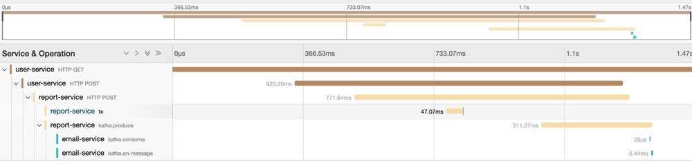

# Traces distribuées avec OpenTelemetry and Jaeger

## Traces distribuées

Une architecture EDA repose sur un système distribué dont il faut observer le comportement (observabilité). En plus des logs et des métriques (Key Perfromances Indicateurs ou KPI), la supervision doit proposer un traçage distribué qui permet de suivre les requêtes et leur déplacement au coeur du système.

## OpenTelemetry

OpenTelemetry une norme récente pour mettre en place la télémétrie (métriques, journaux et traces) dans des applications selon une démarche standardisée.
OpenTelemetry est un standard indépendant des fournisseurs existants de solutions télémétriques. Les données otel sont exportées vers vers ces fournisseurs qui interprétent ce nouveau standard.

OpenTelemetry propose des SDK pour plusieurs langages et bibliothèques. Spring Boot utilise spring-cloud-starter-sleuth-otel.

## Traçage

Le traçage identifie de manière unique toute requête émise dans un système distribué que ce soit a travers HTTP/S, mais également vers un système de messagerie comme kafka.

Les trois composants du traçage sont le Span, le SpanContext et la Trace.

- Le span est le principal élément constitutif d'une trace distribuée. Il représentant une unité de travail individuelle effectuée dans un système distribué.
- Le SpanContext transporte les données au-delà des limites du processus. 
- la trace est une collection de Spans avec la même racine.

## Cas d'usage

La configuration des services est la suivante:


On distingue 3 types de services:

- un service utilisateur qui expose une API HTTP
- un service de reporting qui  expose une API HTTP au service utilisateur  et qui utilise un producteur Kafka pour créer des événements.
- un service de messagerie qui consomme les événements kafka produits par le services de reproting.

L'objectif est de suivre toute demande émise dans le système: depuis le service utilisateur jusqu'au service de messagerie. L'architecture est simplifiée: les  avantages deviennent bien plus importants lorsque le monbre des services impliqués dans un scaénrio augmante. 


L'infrastructure est la suivante:

- Jaeger
- collecteur otel
- zookeeper
- kafka

Jaeger est utilisé pour visualiser les traces.

Otel-collector gère les entrées de spring-otel-exporter, les transforme et envoie le résultat à Jaeger.

Zookeeper et Kafka sont les composants usuels d'infrastructure.

Le collecteur de traces otel est une chaîne de composants configurables:

récepteurs -> traitement -> exporteur


## Résultats

Pour analyser les logs et les traces, il est possible de consulter la sortie standard de l'application elle-même. La sortie du journal dans le service d’application affichera traceId et spanId. 

```bash
2024-05-12 18:21:45.984  INFO [user-service,f515bcf46b607671e1182d5903a5d261,779f554008223b4c] 1 --- [nio-8080-exec-1] c.tracing.service.users.UserController   : Creating new report for user: 1
```

Lorsque la demande initiale transite vers le service de reproting, les journaux du reproting conservent la trace initiale.

```bash
2024-05-12 18:21:46.617  INFO [report-service,f515bcf46b607671e1182d5903a5d261,75dc1c69c94bf0f2] 1 --- [nio-8080-exec-1] c.t.service.reports.ReportController     : Creating new report: 1
```

L'exportateur du collecteur est configuré pour transmettra ses données à Jaeger
Jeager qui interprète le standard otel. Ensuite, Jeager représente visuellement le chemin complet d'une requête associé à un scénario tulisateur.


