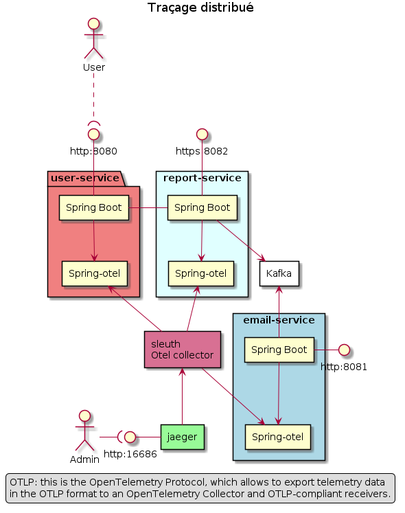

# Traces distribuées avec OpenTelemetry and Jaeger

## Traces distribuées

Une architecture EDA repose sur un système distribué dont il faut observer le comportement (observabilité). En plus des logs et des métriques (Key Perfromances Indicateurs ou KPI), la supervision doit proposer un traçage distribué qui permet de suivre les requêtes et leur déplacement au coeur du système.

## OpenTelemetry

OpenTelemetry est une norme récente pour mettre en place la télémétrie (métriques, journaux et traces) dans des applications selon une démarche standardisée.
OpenTelemetry est un standard indépendant des fournisseurs existants de solutions télémétriques. Les données otel sont exportées vers vers ces fournisseurs qui interprétent ce nouveau standard.

OpenTelemetry propose des SDK pour plusieurs langages et bibliothèques. Spring Boot utilise spring-cloud-starter-sleuth-otel.

## Traçage

Le traçage identifie de manière unique toute requête émise dans un système distribué que ce soit a travers HTTP/S, mais également vers un système de messagerie comme kafka.

Les trois composants du traçage sont le Span, le SpanContext et la Trace.

- Le span est le principal élément constitutif d'une trace distribuée. Il représentant une unité de travail individuelle effectuée dans un système distribué.
- Le SpanContext transporte les données au-delà des limites du processus.
- la trace est une collection de Spans avec la même racine.

## Cas d'usage

La configuration des services est la suivante:


On distingue 3 types de services:

- un service utilisateur qui expose une API HTTP
- un service de reporting qui  expose une API HTTP au service utilisateur  et qui utilise un producteur Kafka pour créer des événements.
- un service de messagerie qui consomme les événements kafka produits par le services de reproting.

L'objectif est de suivre toute demande émise dans le système: depuis le service utilisateur jusqu'au service de messagerie. L'architecture est simplifiée: les  avantages deviennent bien plus importants lorsque le monbre des services impliqués dans un scénario augmante.

L'infrastructure est la suivante:

- Jaeger
- collecteur otel
- zookeeper
- kafka

Jaeger est utilisé pour visualiser les traces.

Otel-collector gère les entrées de spring-otel-exporter, les transforme et envoie le résultat à Jaeger.

Zookeeper et Kafka sont les composants usuels d'infrastructure.

Le collecteur de traces otel est une chaîne de composants configurables:

récepteurs -> traitement -> exporteur


## Déploiement



## Configuration

Comme les applications Java sont configurables via les propriétés et la configuration des fichiers YAML, l'otel-starter peut être modifié dans le fichier application.yaml. La propriété spring.sleuth.otel.config.trace-id-ratio-based définit la probabilité d'exportation de traces à 100 % (Mapping [0.0, 1.0] -> [0, 100] %).

Si le ratio est inférieur à 1,0, alors certaines traces ne seront pas exportées.

otel-spring/tracing-user/src/main/resources/application.yaml

```yaml
server:
  port: 8080
services:
  report:
    url: http://report-service:8080
  email:
    url: http://email-service:8080

spring:
  application:
    name: user-service
  sleuth:
    otel:
      config:
        trace-id-ratio-based: 1.0
      exporter:
        otlp:
          endpoint: http://sleuth:4317
```

### Définition des traces

Toutes les requêtes sont créées à l'aide de RestTemplate.
Spring ajoute des en-têtes de trace aux requêtes et le service de réception sait comment les analyser.

tracing-user/src/main/java/com/tracing/service/users/clients/ReportClient.java

```java
public class ReportClient {
    private final RestTemplate restTemplate;
    @Value("${services.report.url}")
    private String reportURL;
    public ReportClient(RestTemplate restTemplate) {
        this.restTemplate = restTemplate;
    }

    public Report postReportForCustomerId(Long id) {
        HttpHeaders headers = new HttpHeaders();
        headers.setContentType(MediaType.APPLICATION_JSON);

        JSONObject reportJsonObject = new JSONObject();
        reportJsonObject.put("id", id);
        reportJsonObject.put("report", "This new generated report.");

        HttpEntity<String> request = new HttpEntity<String>(reportJsonObject.toString(), headers);

        return restTemplate.postForObject(this.reportURL + "/reports", request, Report.class);
    }
}
```

## Démonstration

### Pré-requis

Git et Maven.

### Installation

Cloner le projet git et fabriquer les paquets.

```bash
git clone https://github.com/chvois1/otel-spring.git
cd otel-spring 
mvn compile
mvn package
```

### Services applicatifs

Dans une fenêtre de commande, lancer les services applicatifs et les services de supervisison.

```bash
cd docker-compose 
start.sh
```

### Service utilisateur

Dans une fenêtre de commande, lancer le service utilisateur.

```bash
cd docker-compose 
start.sh
docker compose up user-service
```

### Tests

Dans une fenêtre de commande, lancer les scripts curl qui interrogent les API Wed du service utilisateur.

```bash
cd docker-compose 
doit.sh
```

### Résultats

Pour analyser les logs et les traces, il est possible de consulter la sortie standard du service utilisateur. 

La sortie de ce service utilisateur affichera traceId et spanId.

```bash
2024-05-12 18:21:45.984  INFO [user-service,f515bcf46b607671e1182d5903a5d261,779f554008223b4c] 1 --- [nio-8080-exec-1] c.tracing.service.users.UserController   : Creating new report for user: 1
```

L'utilisateur fait une demande initiale au service utilisateur et cette demande transite vers le service de reporting. 

Le service de reporting péserve la trace initiale faite au service utilisateur et l'affiche sur sa sortie standard.

```bash
2024-05-12 18:21:46.617  INFO [report-service,f515bcf46b607671e1182d5903a5d261,75dc1c69c94bf0f2] 1 --- [nio-8080-exec-1] c.t.service.reports.ReportController     : Creating new report: 1
```

L'exportateur du collecteur est configuré pour transmettre ses données à Jaeger qui interprète le standard otel. Ensuite, Jaager représente visuellement le chemin complet d'une requête associé à un scénario utilisateur.


